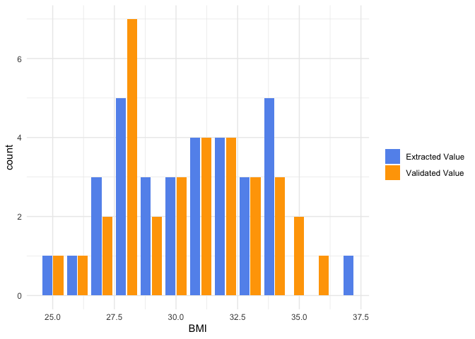

# auditsim


Simulates and audits EHR data extraction accuracy for clinical
measurements.

## What it does

Simulates raw clinical data and then simulates realistic extraction
errors (missing values, measurement noise, transcription mistakes). Then
follows the process detailed in [Lotspeich et
al.](https://arxiv.org/abs/2502.05380) to audit the extracted data
against the source to identify problems.

## Installation

``` r
# Install from GitHub (this will only work if you login because right now it is a private repo but we can change that!)
# devtools::install_github("lucymcgowan/auditsim")

# Or install locally if you download this repo with the package files
# install.packages("path/to/auditsim", repos = NULL, type = "source")

# Load the package
library(auditsim)
```

## Running the code

``` r
library(auditsim)

# Generate sample data and run audit
epic_raw <- simulate_epic()
ehr_sim <- simulate_ehr_from_epic(epic_raw)
audit_results <- run_audit(ehr_sim, epic_raw, roadmap)
```

This will:  
- Generate synthetic patient data with BMI and blood pressure
measurements  
- Simulate extraction errors  
- Run an audit comparing extracted vs source values

## Key functions

- `simulate_epic()` - creates realistic “gold standard” raw clinical
  data
- `simulate_ehr_from_epic()` - adds extraction errors (missing data,
  noise, etc.)
- `run_audit()` - compares extracted values to source, searches notes
  for keywords when data missing
- `roadmap` - default mapping of variables to diagnostic keywords

## Audit categories

- **Extracted Value Correct** - perfect match
- **Extracted Value Incorrect** - values don’t match source
- **\[Keyword\] Found** - missing data but diagnostic keyword found in
  notes
- **Not Found** - no data or keywords

## Requirements

``` r
# Core dependencies (automatically installed with the package)
library(dplyr)
library(tidyr)
library(tibble)
library(stringr)

# For visualization examples
library(ggplot2)
```

## Customizing

Simulate initial raw data:

``` r
epic_raw <- simulate_epic(
  n_patients = 12, # 12 patients
  n_visits = 3, # 3 visits each
  start_date = as.Date("2022-01-01"), # Start Date Jan 2022
  interval = "3 months" # 3 month interval
)
```

Adjust error rates and noise levels in the simulation parameters:

``` r
ehr_sim <- simulate_ehr_from_epic(
  epic_raw,
  p_missing = 0.15, # 15% missing
  p_exact = 0.7, # 70% perfect matches
  bmi_noise_sd = 0.8, # BMI measurement noise
  bp_noise_range = -8:8 # BP variation
)
```

## Run Audit and Visualize Results

``` r
audit <- run_audit(ehr_sim, epic_raw, roadmap)

library(tidyverse)

audit |>
  filter(variable == "body_mass_index") |>
  pivot_longer(cols = c(reviewed_value, extracted_value)) |>
  select(name, value) |>
  drop_na() |>
  ggplot(aes(value, fill = name)) +
  geom_bar(position = position_dodge2(preserve = "single")) +
  scale_fill_manual(
    values = c("cornflowerblue", "orange"),
    labels = c("Extracted Value", "Validated Value")
  ) +
  theme_minimal() +
  labs(x = "BMI", fill = "")
```


